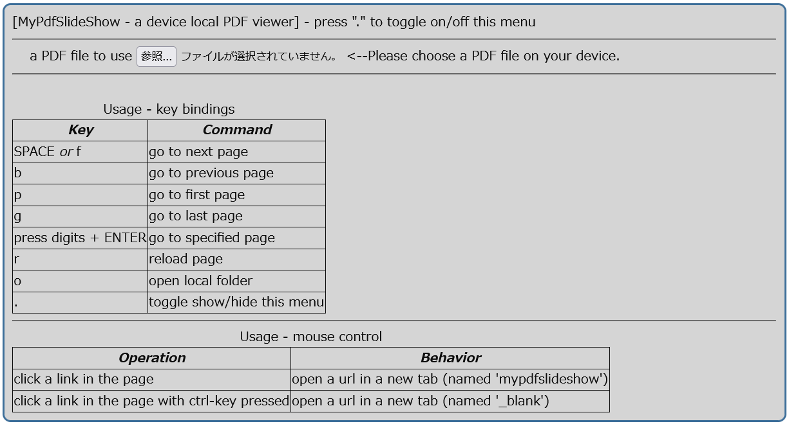

# MyPdfSlideShow

MyPdfSlideShow - a device local PDF viewer

based on [PDF.js](https://mozilla.github.io/pdf.js/).

# capability

It shows a device local PDF file as presentation style.

- ✅open a PDF file __in your device__ locally. (load from the internet is not supported currently)
- ✅render "only" PDF page. no controller on the page.
- ✅to move between pages, use short cut keys (Unix "less" command style is supported currently)
- ✅direct jump to the specified page is supported.

# how to use

## commands

### menu
press "."(period) key to show / hide menu.

## run

### on web 

1. access [the demo site on github.io](https://hrkt.github.io/my-pdf-slideshow/)

### on your device

1. download this repository
2. open index.html using web server such as VSCode [Live Server](https://marketplace.visualstudio.com/items?itemName=ritwickdey.LiveServer), [Web Servrer for Chrome](https://chrome.google.com/webstore/detail/web-server-for-chrome/ofhbbkphhbklhfoeikjpcbhemlocgigb).

## LICENSE

MIT

## CI

- not yet.

## Acknoledgements

### dependencies

- [PDF.js](https://mozilla.github.io/pdf.js/) (Apache2 license)
- [lodash](https://lodash.com/) (MIT license)